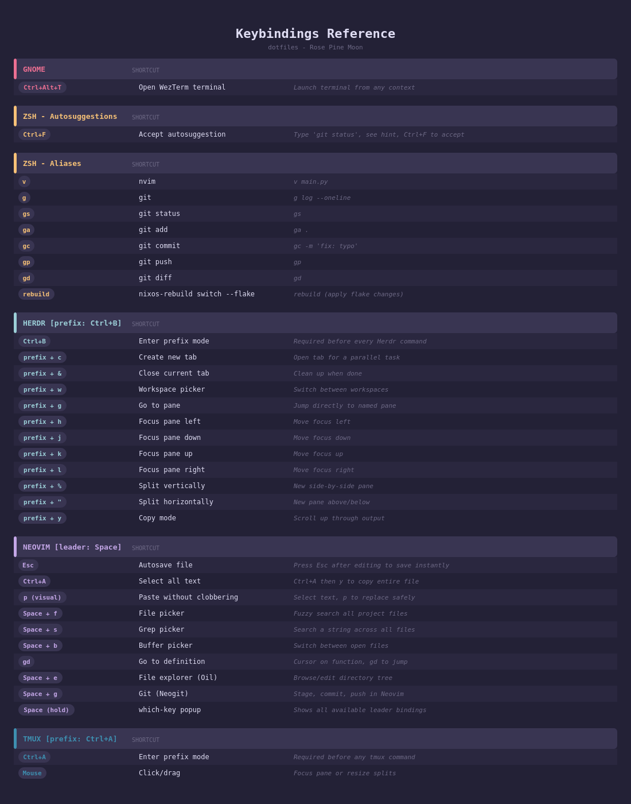

# dotfiles

A reproducible environment for building with AI coding agents, built atop [NixOS and Nix Flakes](https://nixos.wiki/wiki/Flakes). The OS, shell, editor, terminal, and agent rules are all declared as code and pinned to exact versions, so one command reproduces the whole setup on any machine — and rolls it back if an agent ever breaks something. 

---

## About

This repository is my entire NixOS environment as code — the operating system, the user shell, the editor, the terminal, and the rules my AI coding agents follow, all declared in one place and pinned to exact versions. Cloning it onto a fresh NixOS machine and running one command reproduces the whole setup identically.

The design separates two layers: `configuration.nix` defines the machine (packages, GNOME, drivers, fonts), while `home.nix` defines me (shell, prompt, git identity, and symlinks that point every tool's config back into this repo). Application configs live as editable files under `config/`, so tweaking Neovim or WezTerm is instant, while system changes go through a tracked rebuild. A single `home/AGENTS.md` governs Claude Code, Codex, and OpenCode alike — edit once, and every agent's behavior updates.

Adapted from [Kun Chen](https://github.com/kunchenguid)'s agentic dev environment walkthrough, translated from macOS (nix-darwin + Homebrew) to native NixOS.

---

## Structure

```
dotfiles/
├── flake.nix                  # Entry point - defines inputs and outputs
├── configuration.nix          # System config: boot, networking, GNOME, packages
├── home.nix                   # User config: shell, git, symlinks into config/
├── hardware-configuration.nix # Auto-generated (disk UUIDs, kernel modules) - do not edit
├── rebuild.sh                 # Apply flake changes: nixos-rebuild switch
├── config/
│   ├── nvim/                  # Neovim (lazy.nvim, snacks, neogit, oil)
│   ├── wezterm/               # WezTerm terminal emulator
│   ├── herdr/                 # Herdr terminal multiplexer
│   └── claude/                # Claude Code CLI settings
├── home/
│   └── AGENTS.md              # Shared AI agent rules (symlinked to Claude, Codex, OpenCode)
└── docs/
    ├── keybindings.md         # Full keybindings reference with examples
    └── keybindings.png        # Visual keybindings reference card
```

---

## How It Works

- `configuration.nix` manages the system: packages, services, desktop (GNOME + NVIDIA), fonts
- `home.nix` manages the user environment: zsh, git, starship prompt, and symlinks from `config/` into `~/.config/`
- Changes to `config/` (nvim, wezterm, herdr, claude) take effect immediately - no rebuild needed
- Changes to `.nix` files require running `rebuild`

> **Note:** Neovim is pulled from `nixpkgs-unstable` (via a second flake input) to stay on a recent release, while the rest of the system tracks stable `nixos-25.11`. See `flake.nix` inputs and the `pkgs-unstable` wiring in `home.nix`.

---

## Applying Changes

```bash
rebuild   # alias for: sudo nixos-rebuild switch --flake ~/.dotfiles
```

Or from the repo root:

```bash
./rebuild.sh
```

---

## Fresh Machine Setup

Reproduce this entire environment on a new NixOS install:

```bash
# 1. Enable flakes in the stock config, then rebuild:
#    nix.settings.experimental-features = [ "nix-command" "flakes" ];
sudo nixos-rebuild switch

# 2. Clone + create the stable symlink everything references:
git clone git@github.com:USERNAME/dotfiles.git ~/Projects/dotfiles   <!-- VERIFY: your GitHub URL -->
ln -sfn ~/Projects/dotfiles ~/.dotfiles

# 3. Swap in THIS machine's hardware scan (never shared between machines):
cp /etc/nixos/hardware-configuration.nix ~/.dotfiles/

# 4. Build:
cd ~/.dotfiles && git add -A && sudo nixos-rebuild switch --flake .
```

After the build: open a new terminal for zsh + starship, launch `nvim` (lazy.nvim bootstraps plugins on first run), and `claude` to log in.

---

## Key Software

| Tool | Role |
|---|---|
| [NixOS](https://nixos.org/) | Declarative OS configuration |
| [Home Manager](https://github.com/nix-community/home-manager) | User environment management |
| [Herdr](https://github.com/ogulcancelik/herdr) | Agent-aware terminal multiplexer (Ctrl+B prefix) <!-- VERIFY: prefix key if you changed it to Ctrl+A --> |
| [Neovim](https://neovim.io/) | Editor (Space leader, lazy.nvim plugins) |
| [WezTerm](https://wezfurlong.org/wezterm/) | Terminal emulator (Rose Pine Moon, Hack Nerd Font) |
| [Claude Code](https://github.com/anthropics/claude-code) | AI coding agent (rules in `home/AGENTS.md`) |
| [Starship](https://starship.rs/) | Shell prompt |


## Project Memory (Multi-Agent)

Two layers of agent memory apply inside any project:

- **Global** — `home/AGENTS.md`, symlinked to `~/.claude/CLAUDE.md`, `~/.codex/AGENTS.md`, and `~/.config/opencode/AGENTS.md`. Defines *how agents behave* (style, standards, accountability). Applies everywhere, loaded automatically.
- **Project** — a memory file in the project root. Defines *what this project is* (domain, layout, conventions). Applies only within that project. Claude Code loads it automatically alongside the global rules — no setup required for Claude alone.

Because different agents look for different filenames (Claude reads `CLAUDE.md`, Codex and OpenCode read `AGENTS.md`), a project that uses more than one agent needs both names to resolve to the same project-memory content. Symlink them in the project root so one file feeds every agent:

```bash
cd ~/Projects/CATEGORY/PROJECT

# Author the project memory once (any name; AGENTS.md used here as the source):
$EDITOR AGENTS.md

# Point the Claude-specific filename at it:
ln -s AGENTS.md CLAUDE.md

# Commit both to the PROJECT repo (not this dotfiles repo — project memory
# is context for that codebase and travels with it):
git add AGENTS.md CLAUDE.md
git commit -m "Add shared project memory for Claude, Codex, and OpenCode"
```

Notes:

- This is a **within-project** symlink (relative, committed to the project). It is unrelated to the global memory above — keep global and project content distinct: global = behavior, project = context. The two layers stack; agents read both.
- A relative link (`ln -s AGENTS.md CLAUDE.md`, not an absolute path) keeps it valid when the project is cloned elsewhere.
- Verify inside Claude Code with `/memory` — it lists every memory file currently loaded, so you can confirm both the global (via `~/.claude/CLAUDE.md`) and the project file are active.

---

## Reference

- [Keybindings reference](docs/keybindings.md) - all shortcuts across GNOME, Zsh, Herdr, and Neovim
- 

---

## Credits

Setup and agentic environment adapted from [Kun Chen](https://github.com/kunchenguid)'s walkthrough.  
